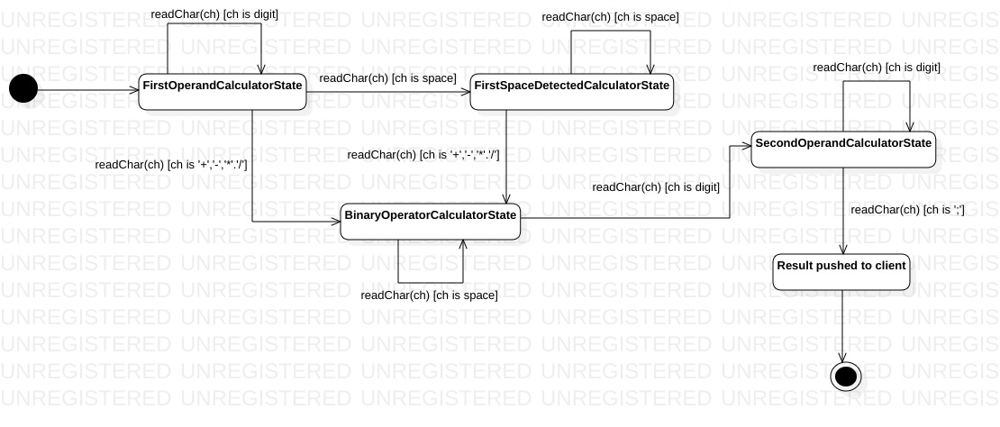
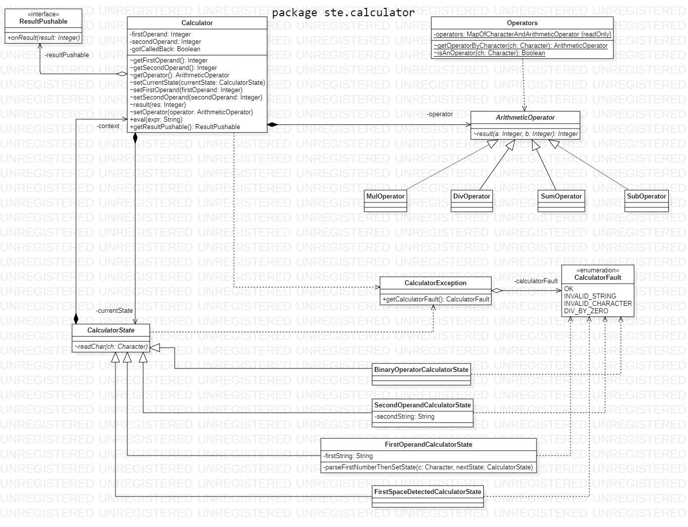

# Calculator
GoF state pattern example

### Little docs





### Compile, run test and code coverage

```
$ mvn clean compile jacoco:report test jacoco:report
```

### Main class

Typical main class 

```java
import ste.calculator.*;

public class Main {

  public static void main(String[] args) throws CalculatorException {
        Calculator c = new Calculator(new ResultPushable() {
            @Override
            public void onResult(int res) {
                System.out.println(res);
            }
        });

        c.eval(args[0]);
  }
  
}  
```

